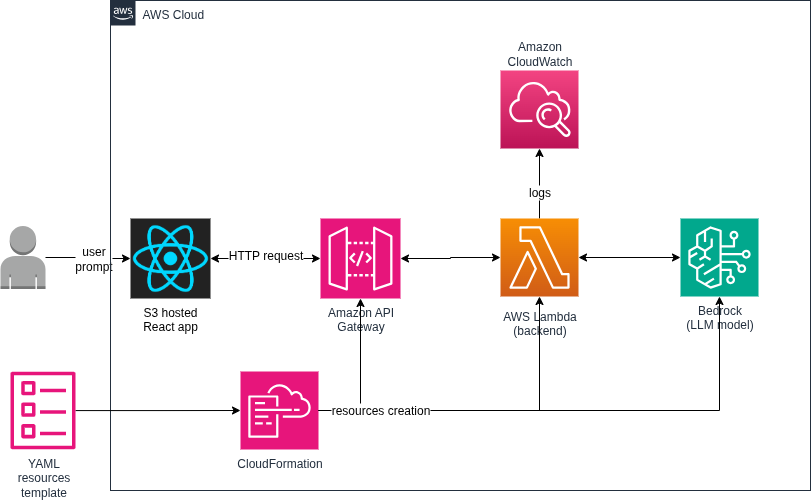

# React Chat Assistant – Project Proposal

## Overview

The React Chat Assistant is a cloud-native, serverless web application. Hosted on AWS, it enables users to interact with a large language model through a browser-based chat interface. Designed for scalability and ease of deployment, the application leverages AWS services to provide a seamless and responsive user experience.

## Features

- **High Quality Conversions**: Users can send text messages to and receive responses from Anthropic and Mistral AI best models through Amazon Bedrock.
- **Serverless Backend**: Processes messages via AWS Lambda, eliminating server management.
- **Scalable API**: Amazon API Gateway routes user requests to the backend, handling high traffic with automatic scaling.
- **Infrastructure as Code**: AWS CloudFormation defines all resources, enabling reproducible, automated deployments.
- **Error Handling**: Error reporting of backend logs in Amazon CloudWatch for insightful debugging.

## Software Architecture

The application architecture is shown in the diagram below

- **S3**: Hosts the React app and Lambda backend JavaScript code, configured for static website hosting with public read access.
- **Lambda**: Executes the Node.js backend for passing input messages to Bedrock LLM and returning the LLM response to the React frontend app.
- **API Gateway**: Provides a REST API for frontend-backend communication, with CORS support.
- **Bedrock**: Powers the conversational AI with one of Claude's language models.
- **CloudFormation**: Defines infrastructure for automated and reproducible deployments.
- **CloudWatch**: Logs backend activity for monitoring and debugging.

## Deployment

1. **Deploy Bucket Stack**:

   - The template `s3bucket.yaml` is for the S3 bucket resources.
   - Run the bash script `deploys3bucket.sh` to create the resources.

2. **Upload Lambda Code**:

   - Run the bash script `deploy.sh` to create a `lambda.zip` package with the Node.js backend and dependencies, and then upload it to S3.

3. **Deploy Application Stack**:

   - The template `application.yaml` is for Lambda, API Gateway, and IAM resources.
   - Run the bash script `deployinfra.sh` to create the resources.

4. **Deploy Frontend**:

   - Run the bash script `deploy.sh` to upload `index.html` to S3.

5. **Test**:

   - Access the chat app at the S3 bucket static website endpoint.
   - Get the `ApiGatewayUrl` from the CloudFormation stack and execute the following command to test the API and Lambda backend: `curl -X POST -H "Content-Type: application/json" -d '{"message":"test"}' ApiGatewayUrl`

## Next Milestones

- Migrate Infrastructure to Terraform.
- Optimize AWS resources allocation.
- Integration of the main React app.
- Other requirements defined by the client.
